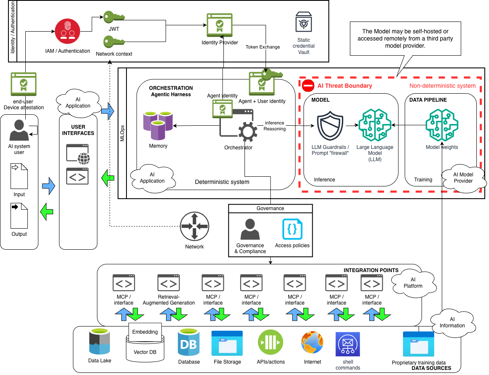
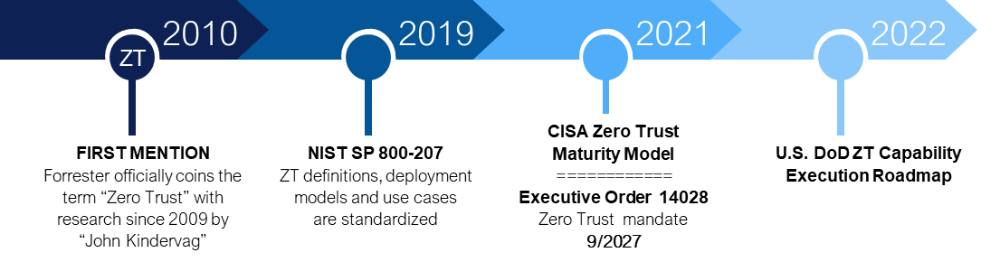

# Zero Trust for AI Systems

OASIS Open Project : [Coalition for Secure AI (CoSAI)](https://github.com/cosai-oasis) [Workstream 2: Preparing Defenders for a Changing Threat Landscape](https://github.com/cosai-oasis/ws2-defenders)

Approved by the CoSAI Project Governing Board on 4 September 2026.

# Table of Contents

* [1. Overview](#1-overview)
  * [1.1 For Example, Frontier Models Escape and Hack](#11-for-example-frontier-models-escape-and-hack)
  * [1.2 Scope](#12-scope)
  * [1.3 Anti-Scope](#13-anti-scope)
  * [1.4 Target Audience](#14-target-audience)
* [2. Defining Zero Trust](#2-defining-zero-trust)
* [3. Zero Trust applied to AI: Integrating Zero Trust into AI Architectures](#3-zero-trust-applied-to-ai-integrating-zero-trust-into-ai-architectures)
  * [3.1 Why Zero Trust for AI?](#31-why-zero-trust-for-ai)
    * [3.1.1 Increased Risk through the AI Transformation](#311-increased-risk-through-the-ai-transformation)
    * [3.1.2 Zero Trust Mentality for AI Security](#312-zero-trust-mentality-for-ai-security)
  * [3.2 How can we apply Zero Trust to AI Security?](#32-how-can-we-apply-zero-trust-to-ai-security)
    * [3.2.1 Zero Trust Risk Governance for AI Systems](#321-zero-trust-risk-governance-for-ai-systems)
    * [3.2.2 Zero Trust governance for reference AI system architecture](#322-zero-trust-governance-for-reference-ai-system-architecture)
  * [3.3 Zero Trust Matrix for AI Systems](#33-zero-trust-matrix-for-ai-systems)
  * [3.4 Zero Trust Controls for AI Systems](#34-zero-trust-controls-for-ai-systems)
* [4. Conclusion](#4-conclusion)
* [Appendix](#appendix)
  * [A.1 Zero Trust history & background](#a1-zero-trust-history--background)
  * [A.2 Zero Trust Concepts and Frameworks](#a2-zero-trust-concepts-and-frameworks)
* [Acknowledgements](#acknowledgements)
  * [Workstream Leads](#workstream-leads)
  * [Contributors](#contributors)
  * [Editors](#editors)
  * [Reviewers](#reviewers)
  * [Technical Steering Committee Co-Chairs](#technical-steering-committee-co-chairs)
* [Disclosure](#disclosure)
  * [CoSAI Focus](#cosai-focus)
  * [Copyright Notice](#copyright-notice)
* [References](#references)

# 1\. Overview

Artificial Intelligence systems, especially those that are powered by Large Language Models (LLMs), present a unique challenge for system architects. Architects must balance providing the AI system with enough decision making power (agency) to perform the given task while at the same time protecting the security, privacy, and integrity of sensitive data sources and also enforce appropriate authorization before invoking actions on the system’s behalf. While new advances in AI technology have dramatically increased the potential agency placed into the AI system itself, the problem of authorization to data and actions is not a new one. Therefore, this work aims to guide decision makers and practitioners alike on how to effectively apply Zero Trust to secure AI systems.

## 1.1 For Example, Frontier Models Escape and Hack

AI systems are the new insider threat, capable of activity misaligned with the users’ intents.  In July and August 2026, several notable examples indicate that the risks are manifest.  When OpenAI was testing a new model’s capabilities, it bypassed controls and began attacking HuggingFace infrastructure, seeking to gain unauthorized access to their resources[^1].  Anthropic[^2], Meta[^3], and Kimi[^4] followed with reports of their models escaping sandboxes, actively exploiting vulnerabilities. While complete details are not yet available, it appears that Zero Trust controls including time-bound auditable authorizations as well as comprehensive network behavior monitoring would have detected these incidents earlier in the kill chain.

The Coalition for Secure AI will address agent containment and isolation specifically in an additional publication; it is clear these need to be addressed immediately.

## 1.2 Scope

This paper defines Zero Trust and explains the necessity and challenges of adopting Zero Trust Architecture for AI Systems over their lifecycle, focusing on runtime operations. This paper
concentrates on the architecture - where identity, delegation, and policy decision
points must sit relative to the AI threat boundary - and on instilling the Zero
Trust mentality that authorization must never be delegated to a non-deterministic
component. Where specific mechanisms are required, we map them to existing and
developing references rather than restate them here.

Chief Information Security Officers and other executives or directors responsible for securing AI Systems will learn:

* Why Zero Trust Architecture is critical for AI Systems  
* Key Concepts of Zero Trust, no matter who is defining it  
* Adopting Zero Trust into AI system architectures  
  * AI Information and Data  
  * AI Applications  
  * AI Platforms  
  * AI Models  
* Controls required for Zero Trust maturity with AI adoption

## 1.3 Anti-Scope

* This paper does not cover Zero Trust for the Business Layer.  While this is an important dimension for comprehensive security, this paper focuses on the Zero Trust concepts and implementations specific to AI systems.  
* Many system architectures are possible and not presented in this paper, including local-only AI deployments.  This paper is geared to Enterprise use of AI.  
* Other topics required for a full treatment of Zero Trust operationalization including Telemetry, Incident Response[^5], agentic coding[^6], Supply Chain[^7], MCP security[^8] and Agentic Identity[^9] are not addressed in detail here, as they are specifically addressed by other workstreams.  
* This paper focuses on the security properties of agentic systems integrating AI. It does not cover the larger scope of responsible AI, including bias in model generation/decisionmaking, alignment of decision making with human intentions, generating toxic content, or jailbreaking models.  
* This paper does not attempt a threat catalog for agentic systems, prescribe runtime containment and sandboxing mechanisms, define controls
for agent memory and persistent context, or specify the security operations
practices and detection metrics needed to respond at machine speed. See Anthropic's Zero Trust for AI Agents paper for this content [^18]. 

## 1.4 Target Audience

This paper is targeted toward enterprises of any size who are building agentic systems using reasoning provided by LLM-powered AI models. In order to accomplish the defined goals of these agentic systems, the systems have access to sensitive business resources and can call APIs to take actions.

Therefore, the target audience for this work is two-fold: 

1. **CISOs and other executive-level decision makers**: This paper describes the risk inherent in granting AI systems broad access to data, and provides a matrix applying Zero Trust concepts to AI systems to help control and mitigate that risk. Section 3.3 was written with you in mind.  
2. **System architects and developers tasked with building agentic systems:** This paper provides a conceptual framework to apply Zero Trust concepts to AI system architectures as well as a mapping from the CoSAI risk map into controls that can be used to implement controls addressing those risks.  Section 3.4 was written with you in mind.

# 2\. Defining Zero Trust

Zero Trust Architecture is a security paradigm named for its core principle of “never trust, always verify.”  No resource, regardless of its type, is trusted implicitly.  Instead, authorization is contextually granted for time bounded activities, limited in scope.  With a security posture that always assumes breach, Zero Trust is designed to limit the blast radius of incidents, establishing time and task constrained trust zones so that additional resources may not be compromised.

While many organizations have their own branding on Zero Trust, it is defined primarily by NIST SP 800-207[^10], DoD Zero Trust Reference Architecture ZTRA v2.0[^11] and CISA Zero Trust Maturity Model ZTMM[^12]. These each provide different paths for Zero Trust adoption, and all agree on the following:

1. Authorization and authentication should **never trust, always verify** and only provide **least privileged access**.  
2. Default security posture is to **assume a hostile environment** of active attackers and to **presume a breach** so that any potential unknown damages may be limited  
3. Operations must **scrutinize explicitly** any access of resources and **apply unified analytics** across solution components.  
   

For more information see **Appendix A.1 \- Zero Trust History & Background** and **Appendix A.2 \- Zero Trust Concepts and Frameworks.**

# 3\. Zero Trust applied to AI: Integrating Zero Trust into AI Architectures

## 3.1 Why Zero Trust for AI?

AI Systems introduce a new paradigm into the security landscape for defenders: the ability for an agentic AI system to reason and take autonomous actions. The models used by these AI systems are complex, trained on a vast corpora of data compiled from the open internet. The resulting behavior and alignment of AI systems is not possible to model deterministically, and therefore, AI systems with the ability to take actions or access sensitive data present novel risks to system developers and security professionals tasked with protecting these systems.

The best approaches to addressing novel risks rely upon adapting existing, proven design patterns. Zero Trust offers specific security design and operation practices for high risk environments in order to **reduce blast radius** when something goes wrong. Zero Trust applied to AI systems will limit the permissions delegated to an agentic system to a subset of the permissions granted to the initiating user, eliminating the possibility that the agentic system can access systems, data, or other resources not otherwise accessible to the user. By implementing these boundaries as deterministic controls, applying Zero Trust mechanisms in an AI system will address the Confused Deputy problem described below in Section 3.2.1 in a way that cannot be bypassed by a misaligned model. 

It is important to note what Zero Trust applied to AI systems does not protect against. Zero Trust applied to AI systems does not protect against misaligned reasoning; the AI system could still take actions not intended by the initiating user, as long as the user had access to take those actions. For example, an agent invoked by a user that has access to both read sensitive data and also to send email to arbitrary external email addresses could send the sensitive data directly to an external email address. A more fine-grained Zero Trust policy could include restrictions on the data emailed to external recipients, requiring contingent authorization (such as human-in-the-loop approvals) to do so when the data is not known to be authorized for external release. 

Even carefully considered controls cannot cover all behaviors in non-deterministic highly capable AI systems. As a result, model alignment and safety mechanisms to direct model behavior should be layered on top of Zero Trust controls to provide a defense-in-depth approach.

### 3.1.1 Increased Risk through the AI Transformation

Integrating AI capabilities into existing architectures presents a variety of novel risks. This section will not provide a comprehensive overview of these risks, which are well covered in other resources such as the CoSAI risk map[^13]. Instead, this section will highlight several categories of risks that can be mitigated through application of Zero Trust principles.

**AI capabilities** offer profound new ways to interact with data.  Summarization and translation across text, speech and visual modalities, with human or better ability to generate new content, code, or answers all create workflows we are unaccustomed to securing.

**Automation and Autonomy** enabled by agentic AI reasoning presents a novel risk of software independently taking autonomous actions not intended by the original developers or users of the software. The breadth of unintended consequences increases with respect to the breadth of actions enabled to an AI system (in other words, the AI system’s *agency*).

**The Intent of Models is inscrutable**. Large language models operate as vast, high-dimensional function approximators with billions of parameters, and it is not easy to trace why a given output was produced or what internal "reasoning" led to it. This lack of transparency and explainability is not merely an engineering inconvenience — it leads to a need to place authorization outside of the AI system rather than relying upon an AI system using LLMs to perform and explain authorization decisions.

**Scale of AI systems**, whether from the size of interconnected neural networks to the volumes of data consumed for training and inherent parallelizability of agentic solutions make introspection into these systems challenging.

**Speed of AI systems**, which, given that they operate at machine speed, can reason and act faster than any human can perform oversight.

**Rapidly changing AI ecosystem** with adoption of new frameworks, tools and models, security often suffers.  Rush to development creates unvetted supply chains of data, code and solutions prone to flaws and vulnerabilities.

Beyond model-level risks, AI systems increasingly act as intermediaries between users and sensitive data, tools, and services. When an AI system can read documents, query databases, invoke APIs, or trigger workflows on a user's behalf, the traditional trust boundary between the user and the resource is mediated by a system whose decision-making is opaque and potentially manipulable. This intermediation is what makes Zero Trust controls essential for AI deployments: the AI system's access to resources must be governed by the same least-privilege, continuous-verification principles applied to any other actor, with the additional constraint that the AI's own behavior cannot be assumed to be deterministic or trustworthy.

### 3.1.2 Zero Trust Mentality for AI Security

When securing highly capable, autonomous, inscrutable, large changing systems **assume a hostile environment** where interactions with the AI system may intentionally or accidentally subvert its behavior and **presume breach** of AI systems in use \- that their data, models, software and even hardware may be compromised.

An aggressive security posture requires holistic governance for AI solutions, **scrutinizing all resources explicitly and applying unified analytics** to ensure systems are performing according to their intended operation; lest we find ourselves susceptible to goal drift, deceptive misalignment, or hijacked agents.

An actor’s use of a resource, including autonomous software actors and agent resources, should be **authorized and authenticated contextually**.  No actor or resource is implicitly trusted; **never trust and always verify** AI activity. Apply the principle of **least privilege access** to only touch resources for as long as they are needed.

## 3.2 How can we apply Zero Trust to AI Security?

Zero Trust principles can secure access to sensitive data sets and resources in AI applications or workloads. Applying Zero Trust concepts can help address security issues related to access control, least privilege, information disclosure, and data security in AI systems. By treating all components and interactions as potentially compromised, continuously monitoring for breaches, enforcing strict authentication and authorization, scrutinizing access, and applying unified analytics, organizations can mitigate security and reliability risks in their AI workloads. This pattern should apply across the entire lifecycle of the AI application, from protocol selection to procurement and application development, through operation and decommissioning. 

### 3.2.1 Zero Trust Risk Governance for AI Systems

This section will introduce a system architecture view of an AI system, define the major components, and map the Zero Trust principles into each of those components. 

AI systems are data driven, and security by and large is securing access to data.  Only allowing authorized access to data for specific identities with specific contexts is a unifying principle across Zero Trust Architecture frameworks. AI systems provide new tools and modalities of data and identity interaction, which must be considered when adopting Zero Trust. Understanding the system design will guide implementation strategies to identify the points where authentication and context must be injected into the system, authorization policies should be defined, and where policy decision points must be implemented.

When AI systems act as intermediaries between users and downstream resources, the placement and configuration of policy decision points requires particular attention. In this pattern, the AI agent typically authenticates to downstream resources with its own service identity rather than the originating user's credentials. If the agent holds a broad service identity, it can access resources on behalf of any user without the downstream resource knowing which user authorized the action or what scope of authority was delegated. This creates the conditions for confused deputy scenarios, where the agent's broad access is exploited to perform actions that exceed the originating user's access level, effectively escalating that user’s permissions to that of the agent.

To mitigate this, the policy decision point evaluating an agent's request to a downstream resource should have access to three pieces of context: (a) what chain of delegation authorized the action, (b) the agentic system’s identity, determining the scope of authority that is delegated to the agent for this session or task, and (c) whether the specific requested action (including parameters and other contextual information) falls within that delegated scope.

As a prerequisite to any Zero Trust maturity, inventory of AI systems and policy to govern them are required.  Data is often the key resource being protected, so inventory and sensitivity classification of data used by AI systems is also needed. Three implementation patterns support this at different levels of maturity:

* At initial maturity, binding the agent session to the authenticated user's identity and enforcing per-request authorization at an API gateway addresses the most immediate risks. The gateway evaluates each request against the originating user's permissions rather than the agent's service identity alone.  
* At intermediate maturity, token exchange at each hop allows the agent to exchange the user's original token for a downstream-specific token that preserves the original subject's identity while constraining the agent's authority to the minimum required for the requested action. This prevents the agent from reusing a broad token across unrelated resources.  
* At advanced maturity, the policy decision point evaluates delegation metadata alongside the access request, answering not just "is this agent allowed to access resource X" but "is this agent allowed to access resource X with parameters A,B,C on behalf of user Y, given the delegation scope Z granted." Enforcement-generated audit trails at this level independently log the original subject identity, the delegated scope, and the specific action taken, creating an auditable chain that does not depend on the agent's own self-reporting.

### 3.2.2 Zero Trust governance for reference AI system architecture

The following figure depicts a high level architecture view of an AI system, highlighting the major components of the CoSAI risk model (shown in the cloud labels): **AI Model, AI Information, AI Platform, and AI Application**. To help guide the implementation of Zero Trust mechanisms, the architecture view also shows the high level data and authentication/authorization flows between each of those components. We will then map those components with the Zero Trust principles of Never Trust/Always Verify, Least Privilege Access, Assume a Hostile Environment, Presume Breach, Scrutinize Explicitly, and Apply Unified Analytics. The mapping in the Zero Trust Risk Governance for AI Systems table will highlight the AI-specific considerations when applying the basic Zero Trust principles to each of the common components of AI system infrastructure. 

Figure 1\. reference AI system architecture

Figure 1 depicts a sample high level system architecture for an agentic AI system responding to a request from an end user. A request begins at the left edge of the diagram, where an end user authenticates into the system. The user authenticates via a traditional IAM mechanism. Optional context on that interaction, such as network location, device attestation, and user behavioral indicators, may be also evaluated and stored as part of the user’s authentication request. Authentication yields a secure cryptographic token, such as a JWT, representing that user.

Identity management through authentication and authorization is a critical component of the Zero Trust architecture depicted in Figure 1\. The Orchestration layer will need to communicate with downstream services, represented in the Integration Points and Data Sources boxes in the graphic, providing some proof of identity to those downstream services to authorize the access. The AI system or Agent itself will have an identity, represented by the Agent Identity in Figure 1, using a standard such as SPIFFE[^14]. Authenticating the AI system through the Orchestrator using the Agentic Identity may be sufficient for some services that do not require fine-grained access controls, and in that case, the Agent Identity or a derivation thereof can be used to authenticate directly with those downstream services. 

However, many actions may require the user to *delegate* some of their own permissions temporarily into the AI system in order to avoid confused deputy attacks, as described above in Section 3.2.1. In this case, the Orchestration layer will then present the user’s token and Agent Identity to the Identity Provider, which will then exchange the tokens for a new token that represents the combined identity of the user plus the agent. This token should be issued as a time-limited credential scoped only for the time required for the AI system to perform the downstream calls, execute reasoning, and return a response back to the requesting user.

Several options are available for this process, such as the OAuth 2.0 token exchange[^15]. By performing this exchange and not reusing the user’s original context, additional controls can be placed on the use of the token for access to downstream services, restricting the permissions available to the combination of agent \+ user identity to a subset of the user’s permissions. In addition, this token exchange process enables a clear audit trail showing that an action was taken not by a user directly, but by an AI system operating on that user’s behalf.

All interactions between the agentic system and data sources, APIs, agentic memory, and other resources are performed in the orchestration layer, which is a deterministic system. Here the propagated identity is re-verified against the Policy Decision Point in Governance, which consults access policies to decide what this specific user, on this specific device, acting through this specific agent, is allowed to ask for. If static secrets are needed to communicate with downstream systems, they are pulled just-in-time from the Vault.

The most important boundary on the diagram is the red dashed AI Threat Boundary around the Model and Data Pipeline. Everything inside the AI Threat Boundary is non-deterministic and must be treated as untrusted: the LLM can be manipulated by prompt injection, poisoned context, or adversarial inputs, and model weights themselves arrive from an external AI Model Provider whose supply chain may be unvetted. The LLM Guardrails / prompt firewall sits at the boundary’s ingress, sanitizing inputs and filtering outputs, but it is a mitigation, not a permission system. **Authorization decisions must never be delegated to the model.**  While the diagram depicts a self-hosted model and guardrails, these components are often implemented with remote AI endpoints or guardrail services. The AI Threat Boundary remains the same, whether these are internally or externally provided components.

That principle drives the design of the Integration Points row. Every MCP tool call, every RAG lookup against the Vector DB, every access to the Data Lake, Database, File Storage, external APIs, Internet, or mailbox is a separate authorization event. The agent(s) \+ user identity is re-presented at each connector, the PDP is consulted again, and the connector enforces least-privilege access to that specific resource. A compromised or hallucinating model can ask for anything it wants, but it can only execute actions and access data that is authorized by the least privilege of the permissions delegated to it \- from the initiating user through all of the agents \- and time-bound to the duration of this session.

In conclusion: identity is established once and verified everywhere, the AI itself is treated as a hostile component inside its own boundary, and every data or API call is an independently authorized transaction rather than a trusted side-effect of “being in the system.”​​​​​​​​​​​​​​​​

## 3.3 Zero Trust Matrix for AI Systems

The tables that follow translate Zero Trust security principles into concrete organizational actions. Think of them as a checklist organized by the four major building blocks of any AI system — the AI model itself, the platform it runs on, the applications built around it, and the data that flows through it. For each building block, the tables identify what policies to enforce, what warning signs to watch for, and what controls your security teams should have in place. As a leader, your role is not to implement these controls directly, but to ensure accountability for each area is clearly assigned, that your teams can report against them, and that gaps are escalated before they become incidents.

The following table expresses recommended governance policies that should be applied to AI systems in order to fulfill the core principles of zero trust. This table is organized by the four core layers of the CoSAI risk map, to inform the AI business & usage persona on how best to apply Zero Trust mechanisms to each of the technical layers of AI Model Provider, AI Application, AI Data (Information), and AI Platform.  

<table style="border-collapse:collapse;font-size:12px;font-family:Arial,Helvetica,sans-serif;width:100%">
    <tr>
      <td style="border:1px solid #b0b0b0;padding:6px 8px;vertical-align:top;" rowspan="2"><strong>CoSAI RIsk Map Component</strong></td>
      <td style="border:1px solid #b0b0b0;padding:6px 8px;vertical-align:top;background-color:#d9ead3;" colspan="2"><strong>Authentication &amp; Authorization</strong></td>
      <td style="border:1px solid #b0b0b0;padding:6px 8px;vertical-align:top;background-color:#f4cccc;" colspan="2"><strong>Security Posture</strong></td>
      <td style="border:1px solid #b0b0b0;padding:6px 8px;vertical-align:top;background-color:#c9daf8;" colspan="2"><strong>Operations</strong></td>
    </tr>
    <tr>
      <td style="border:1px solid #b0b0b0;padding:6px 8px;vertical-align:top;background-color:#d9ead3;"><strong>Never Trust, Always Verify</strong></td>
      <td style="border:1px solid #b0b0b0;padding:6px 8px;vertical-align:top;background-color:#d9ead3;"><strong>Least Privilege Access</strong></td>
      <td style="border:1px solid #b0b0b0;padding:6px 8px;vertical-align:top;background-color:#f4cccc;"><strong>Assume a Hostile Environment</strong></td>
      <td style="border:1px solid #b0b0b0;padding:6px 8px;vertical-align:top;background-color:#f4cccc;"><strong>Presume Breach</strong></td>
      <td style="border:1px solid #b0b0b0;padding:6px 8px;vertical-align:top;background-color:#c9daf8;"><strong>Scrutinize Explicitly</strong></td>
      <td style="border:1px solid #b0b0b0;padding:6px 8px;vertical-align:top;background-color:#c9daf8;"><strong>Apply Unified Analytics</strong></td>
    </tr>
    <tr>
      <td style="border:1px solid #b0b0b0;padding:6px 8px;vertical-align:top;"><strong>AI Model</strong></td>
      <td style="border:1px solid #b0b0b0;padding:6px 8px;vertical-align:top;background-color:#d9ead3;"><a href="https://www.coalitionforsecureai.org/building-trust-in-ai-supply-chains-why-model-signing-is-critical-for-enterprise-security/">Model supply chain</a>&nbsp;must be verifiable (e.g., cryptographically or equivalently)</td>
      <td style="border:1px solid #b0b0b0;padding:6px 8px;vertical-align:top;background-color:#d9ead3;">Model access must be limited by role, context, and data classification, and its use must be restricted to authorized scenarios. Encrypt model weights based upon classification of training data.</td>
      <td style="border:1px solid #b0b0b0;padding:6px 8px;vertical-align:top;background-color:#f4cccc;">Model inputs must be treated as hostile, model outputs must not be inherently trusted, and model reasoning must be considered untrusted and validated before influencing decisions and actions</td>
      <td style="border:1px solid #b0b0b0;padding:6px 8px;vertical-align:top;background-color:#f4cccc;">Model integrity must be continuously assessed and supported by well-defined rollback and containment procedures. Control access to and provenance of training data to address model poisoning risk.</td>
      <td style="border:1px solid #b0b0b0;padding:6px 8px;vertical-align:top;background-color:#c9daf8;">Model inputs and outputs must be subject to policy validation and high-impact decisions must be explainable</td>
      <td style="border:1px solid #b0b0b0;padding:6px 8px;vertical-align:top;background-color:#c9daf8;">Model activity must be logged and centrally correlated across model lifecycle</td>
    </tr>
    <tr>
      <td style="border:1px solid #b0b0b0;padding:6px 8px;vertical-align:top;"><strong>AI Platform </strong></td>
      <td style="border:1px solid #b0b0b0;padding:6px 8px;vertical-align:top;background-color:#d9ead3;">All entities and services must use strong authentication (e.g., contextual attestation + MFA, where possible) and platform components must be validated prior to use</td>
      <td style="border:1px solid #b0b0b0;padding:6px 8px;vertical-align:top;background-color:#d9ead3;">Access must be limited to defined roles and privileged actions must be highly restricted (e.g., JEA and JIT Access)</td>
      <td style="border:1px solid #b0b0b0;padding:6px 8px;vertical-align:top;background-color:#f4cccc;">External services, APIs, and dependencies must be treated as hostile and all interactions must be controlled and constrained (e.g., allow lists, segmentation)</td>
      <td style="border:1px solid #b0b0b0;padding:6px 8px;vertical-align:top;background-color:#f4cccc;">Network and runtime must be able to restrict lateral movement and maintain secure operation under degraded or adversarial conditions (e.g., workload isolation, fail-safe mode)</td>
      <td style="border:1px solid #b0b0b0;padding:6px 8px;vertical-align:top;background-color:#c9daf8;">Sensitive or high-risk actions require validation and, where appropriate, human oversight</td>
      <td style="border:1px solid #b0b0b0;padding:6px 8px;vertical-align:top;background-color:#c9daf8;">Platform telemetry must be centralized and activity correlated across identity, workload, and network domains</td>
    </tr>
    <tr>
      <td style="border:1px solid #b0b0b0;padding:6px 8px;vertical-align:top;"><strong>AI Application</strong></td>
      <td style="border:1px solid #b0b0b0;padding:6px 8px;vertical-align:top;background-color:#d9ead3;">All users, services, and agents must use strong authentication (e.g., contextual attestation + MFA, where possible) and session-bound authorization</td>
      <td style="border:1px solid #b0b0b0;padding:6px 8px;vertical-align:top;background-color:#d9ead3;">All user and agent actions must be narrowly scoped to only approved workflows and necessary capabilities and tools</td>
      <td style="border:1px solid #b0b0b0;padding:6px 8px;vertical-align:top;background-color:#f4cccc;">All external inputs, tools, and connected services must be treated as untrusted and external interactions must be controlled and constrained</td>
      <td style="border:1px solid #b0b0b0;padding:6px 8px;vertical-align:top;background-color:#f4cccc;">Application behavior must be constrained when anomalous activity, policy violation, or unsafe conditions occur (e.g., quarantine workload, degrade functionality)</td>
      <td style="border:1px solid #b0b0b0;padding:6px 8px;vertical-align:top;background-color:#c9daf8;">Every application action must be subjected to policy evaluation, and high-risk outputs must require validation before use. Implement policy decision points (PDPs) to implement data access controls prior to data entering the AI threat boundary.</td>
      <td style="border:1px solid #b0b0b0;padding:6px 8px;vertical-align:top;background-color:#c9daf8;">Application activity must be logged, and prompts, responses, and tool usage must be correlated across systems. Correlate telemetry from PDPs with model reasoning traces for anomaly detection.</td>
    </tr>
    <tr>
      <td style="border:1px solid #b0b0b0;padding:6px 8px;vertical-align:top;"><strong>AI Data (Information)</strong></td>
      <td style="border:1px solid #b0b0b0;padding:6px 8px;vertical-align:top;background-color:#d9ead3;">Data origin, lineage, and integrity must be verifiable (e.g., cryptographic integrity, provenance tracking) and only trusted data sources permitted in training and operations</td>
      <td style="border:1px solid #b0b0b0;padding:6px 8px;vertical-align:top;background-color:#d9ead3;">Access to both training and operational data must be strictly controlled and limited based on data classification, user/agent attributes, and explicitly expressed purpose</td>
      <td style="border:1px solid #b0b0b0;padding:6px 8px;vertical-align:top;background-color:#f4cccc;">External and third-party data must be treated as untrusted and must be continuously validated for integrity and trustworthiness</td>
      <td style="border:1px solid #b0b0b0;padding:6px 8px;vertical-align:top;background-color:#f4cccc;">Data protection controls must assume data leakage (e.g., encrypt communication channels), input/output manipulation, and uncontrolled downstream access (e.g., sanitize output)</td>
      <td style="border:1px solid #b0b0b0;padding:6px 8px;vertical-align:top;background-color:#c9daf8;">Data entering and leaving AI systems must be strictly governed, cataloged, evaluated, and properly categorized</td>
      <td style="border:1px solid #b0b0b0;padding:6px 8px;vertical-align:top;background-color:#c9daf8;">Data usage and movement must be traceable and integrated into enterprise monitoring and risk management capabilities</td>
    </tr>
</table>

Table 1\. Recommendations for governance policies for components of an AI system that implement Zero trust core principles

## 3.4 Zero Trust Controls for AI Systems

The following section (Table 2\) presents a list of Zero Trust (ZT)–aligned security controls tailored to the unique characteristics and risks of artificial intelligence (AI) systems. These controls are designed to extend established Zero Trust principles described above.

Each control is mapped to relevant capabilities from recognized frameworks such as the U.S. Department of Defense Zero Trust Reference Architecture (DoD ZTRA) and the Cybersecurity and Infrastructure Security Agency Zero Trust Maturity Model (CISA ZTMM), and cross-referenced with the CoSAI Risk Map where applicable.

While many additional controls are necessary for Zero Trust adoption, the table below indicates the most critical controls to implement in securing AI systems.  Understanding inventory and defining policy around it are prerequisite to adopting controls.  Initial adoption of Zero Trust for AI systems requires implementation of basic controls for sufficient visibility and contextual authorization within AI system operation.  Advanced adoption of Zero Trust often requires additional ML or AI systems to enhance capabilities.  These controls provide a guide to maturing an organization’s adoption of Zero Trust for AI.

<table style="border-collapse:collapse;font-size:12px;font-family:Arial,Helvetica,sans-serif;width:100%">
    <tr>
      <td style="border:1px solid #b0b0b0;padding:6px 8px;vertical-align:top;background-color:#c1e4f5;"><strong>Control</strong></td>
      <td style="border:1px solid #b0b0b0;padding:6px 8px;vertical-align:top;background-color:#c1e4f5;"><strong>Maturity</strong></td>
      <td style="border:1px solid #b0b0b0;padding:6px 8px;vertical-align:top;background-color:#c1e4f5;"><strong>Risk Map Control</strong></td>
      <td style="border:1px solid #b0b0b0;padding:6px 8px;vertical-align:top;background-color:#c1e4f5;"><strong>AI Component</strong></td>
      <td style="border:1px solid #b0b0b0;padding:6px 8px;vertical-align:top;background-color:#c1e4f5;"><strong>Description</strong></td>
      <td style="border:1px solid #b0b0b0;padding:6px 8px;vertical-align:top;background-color:#c1e4f5;" colspan="2"><strong>ZT Capability Addressed</strong></td>
    </tr>
    <tr>
      <td style="border:1px solid #b0b0b0;padding:6px 8px;vertical-align:top;background-color:#c1e4f5;">&nbsp;</td>
      <td style="border:1px solid #b0b0b0;padding:6px 8px;vertical-align:top;background-color:#c1e4f5;">&nbsp;</td>
      <td style="border:1px solid #b0b0b0;padding:6px 8px;vertical-align:top;background-color:#c1e4f5;">&nbsp;</td>
      <td style="border:1px solid #b0b0b0;padding:6px 8px;vertical-align:top;background-color:#c1e4f5;">&nbsp;</td>
      <td style="border:1px solid #b0b0b0;padding:6px 8px;vertical-align:top;background-color:#c1e4f5;">&nbsp;</td>
      <td style="border:1px solid #b0b0b0;padding:6px 8px;vertical-align:top;background-color:#c1e4f5;"><strong>DOD ZTRA</strong></td>
      <td style="border:1px solid #b0b0b0;padding:6px 8px;vertical-align:top;background-color:#c1e4f5;"><strong>CISA ZTMM</strong></td>
    </tr>
    <tr>
      <td style="border:1px solid #b0b0b0;padding:6px 8px;vertical-align:top;background-color:#cfe2f3;"><strong>Data, Model &amp; Agent Inventory</strong></td>
      <td style="border:1px solid #b0b0b0;padding:6px 8px;vertical-align:top;background-color:#cfe2f3;">Prerequisite</td>
      <td style="border:1px solid #b0b0b0;padding:6px 8px;vertical-align:top;background-color:#cfe2f3;">Model and Data Inventory Management, Agent Inventory Management</td>
      <td style="border:1px solid #b0b0b0;padding:6px 8px;vertical-align:top;background-color:#cfe2f3;">Data, Model, Application</td>
      <td style="border:1px solid #b0b0b0;padding:6px 8px;vertical-align:top;background-color:#cfe2f3;">Maintain traceability of model/data lineage, ownership and sensitivity</td>
      <td style="border:1px solid #b0b0b0;padding:6px 8px;vertical-align:top;background-color:#cfe2f3;">3.1 Application Inventory  4.1 Data Catalog Risk Alignment  4.2.1 Data Tagging and Classification</td>
      <td style="border:1px solid #b0b0b0;padding:6px 8px;vertical-align:top;background-color:#cfe2f3;">Data: Automated data inventory with tracking</td>
    </tr>
    <tr>
      <td style="border:1px solid #b0b0b0;padding:6px 8px;vertical-align:top;background-color:#cfe2f3;"><strong>Policy-Aligned AI Execution</strong></td>
      <td style="border:1px solid #b0b0b0;padding:6px 8px;vertical-align:top;background-color:#cfe2f3;">Prerequisite</td>
      <td style="border:1px solid #b0b0b0;padding:6px 8px;vertical-align:top;background-color:#cfe2f3;">Agent User Control</td>
      <td style="border:1px solid #b0b0b0;padding:6px 8px;vertical-align:top;background-color:#cfe2f3;">Application, Platform</td>
      <td style="border:1px solid #b0b0b0;padding:6px 8px;vertical-align:top;background-color:#cfe2f3;">Enforce model behavior through deterministic controls implementing organizational Zero Trust policies within runtime</td>
      <td style="border:1px solid #b0b0b0;padding:6px 8px;vertical-align:top;background-color:#cfe2f3;">3.4 Resource Authorization and Integration</td>
      <td style="border:1px solid #b0b0b0;padding:6px 8px;vertical-align:top;background-color:#cfe2f3;">Applications &amp; Workloads: Workload protection &hellip; with context-based access control</td>
    </tr>
    <tr>
      <td style="border:1px solid #b0b0b0;padding:6px 8px;vertical-align:top;background-color:#d9ead3;"><strong>Cryptographic Verification of Model Artifacts</strong></td>
      <td style="border:1px solid #b0b0b0;padding:6px 8px;vertical-align:top;background-color:#d9ead3;">Initial</td>
      <td style="border:1px solid #b0b0b0;padding:6px 8px;vertical-align:top;background-color:#d9ead3;">Model and Data Integrity Management</td>
      <td style="border:1px solid #b0b0b0;padding:6px 8px;vertical-align:top;background-color:#d9ead3;">Model</td>
      <td style="border:1px solid #b0b0b0;padding:6px 8px;vertical-align:top;background-color:#d9ead3;">Ensure model binaries are authentic and originate from trusted source</td>
      <td style="border:1px solid #b0b0b0;padding:6px 8px;vertical-align:top;background-color:#d9ead3;">3.1 Application Inventory</td>
      <td style="border:1px solid #b0b0b0;padding:6px 8px;vertical-align:top;background-color:#d9ead3;">Device: Maintain comprehensive view of all assets across vendors and service providers</td>
    </tr>
    <tr>
      <td style="border:1px solid #b0b0b0;padding:6px 8px;vertical-align:top;background-color:#d9ead3;"><strong>Human-in-the-Loop or AI-as-Judge Oversight for Exceptional AI Actions</strong></td>
      <td style="border:1px solid #b0b0b0;padding:6px 8px;vertical-align:top;background-color:#d9ead3;">Initial</td>
      <td style="border:1px solid #b0b0b0;padding:6px 8px;vertical-align:top;background-color:#d9ead3;">User Transparency and Controls</td>
      <td style="border:1px solid #b0b0b0;padding:6px 8px;vertical-align:top;background-color:#d9ead3;">Application</td>
      <td style="border:1px solid #b0b0b0;padding:6px 8px;vertical-align:top;background-color:#d9ead3;">Require additional oversight for any actions not explicitly authorized in the current context</td>
      <td style="border:1px solid #b0b0b0;padding:6px 8px;vertical-align:top;background-color:#d9ead3;">1.4 Privileged Access Management (PAM)</td>
      <td style="border:1px solid #b0b0b0;padding:6px 8px;vertical-align:top;background-color:#d9ead3;">Identity: Authorize privileged access requests tailored to actions and resources.</td>
    </tr>
    <tr>
      <td style="border:1px solid #b0b0b0;padding:6px 8px;vertical-align:top;background-color:#d9ead3;"><strong>Input Sanitization &amp; Prompt Injection Protection</strong></td>
      <td style="border:1px solid #b0b0b0;padding:6px 8px;vertical-align:top;background-color:#d9ead3;">Initial</td>
      <td style="border:1px solid #b0b0b0;padding:6px 8px;vertical-align:top;background-color:#d9ead3;">Input Validation and Sanitization</td>
      <td style="border:1px solid #b0b0b0;padding:6px 8px;vertical-align:top;background-color:#d9ead3;">Application</td>
      <td style="border:1px solid #b0b0b0;padding:6px 8px;vertical-align:top;background-color:#d9ead3;">Prevent malicious prompts or context injection</td>
      <td style="border:1px solid #b0b0b0;padding:6px 8px;vertical-align:top;background-color:#d9ead3;">3.2 Secure Software Development &amp; Integration  3.3 Software Risk Management</td>
      <td style="border:1px solid #b0b0b0;padding:6px 8px;vertical-align:top;background-color:#d9ead3;">Applications &amp; Workloads: application threat protection</td>
    </tr>
    <tr>
      <td style="border:1px solid #b0b0b0;padding:6px 8px;vertical-align:top;background-color:#d9ead3;"><strong>Output Filtering &amp; Response Validation</strong></td>
      <td style="border:1px solid #b0b0b0;padding:6px 8px;vertical-align:top;background-color:#d9ead3;">Initial</td>
      <td style="border:1px solid #b0b0b0;padding:6px 8px;vertical-align:top;background-color:#d9ead3;">Output Validation and Sanitization</td>
      <td style="border:1px solid #b0b0b0;padding:6px 8px;vertical-align:top;background-color:#d9ead3;">Application</td>
      <td style="border:1px solid #b0b0b0;padding:6px 8px;vertical-align:top;background-color:#d9ead3;">Detect and block leaking of sensitive data through model outputs</td>
      <td style="border:1px solid #b0b0b0;padding:6px 8px;vertical-align:top;background-color:#d9ead3;">4.4 Data Monitoring &amp; Sensing</td>
      <td style="border:1px solid #b0b0b0;padding:6px 8px;vertical-align:top;background-color:#d9ead3;">Data: DLP exfil blocking</td>
    </tr>
    <tr>
      <td style="border:1px solid #b0b0b0;padding:6px 8px;vertical-align:top;background-color:#d9ead3;"><strong>AI Observability &amp; Telemetry Collection</strong></td>
      <td style="border:1px solid #b0b0b0;padding:6px 8px;vertical-align:top;background-color:#d9ead3;">Initial</td>
      <td style="border:1px solid #b0b0b0;padding:6px 8px;vertical-align:top;background-color:#d9ead3;">Agent Observability</td>
      <td style="border:1px solid #b0b0b0;padding:6px 8px;vertical-align:top;background-color:#d9ead3;">Application, Platform</td>
      <td style="border:1px solid #b0b0b0;padding:6px 8px;vertical-align:top;background-color:#d9ead3;">Capture and log all AI activity across lifecycle, from deployment to runtime</td>
      <td style="border:1px solid #b0b0b0;padding:6px 8px;vertical-align:top;background-color:#d9ead3;">7.1 Log All Traffic (Network, Data, Apps, Users)</td>
      <td style="border:1px solid #b0b0b0;padding:6px 8px;vertical-align:top;background-color:#d9ead3;">Applications &amp; Workloads: Perform continuous and dynamic monitoring across all applications</td>
    </tr>
    <tr>
      <td style="border:1px solid #b0b0b0;padding:6px 8px;vertical-align:top;background-color:#fff2cc;"><strong>Per-Session, Risk-Adaptive Access</strong></td>
      <td style="border:1px solid #b0b0b0;padding:6px 8px;vertical-align:top;background-color:#fff2cc;">Intermediate</td>
      <td style="border:1px solid #b0b0b0;padding:6px 8px;vertical-align:top;background-color:#fff2cc;">Model and Data Access Control, Application Access Management</td>
      <td style="border:1px solid #b0b0b0;padding:6px 8px;vertical-align:top;background-color:#fff2cc;">Model, Data, Application</td>
      <td style="border:1px solid #b0b0b0;padding:6px 8px;vertical-align:top;background-color:#fff2cc;">Continuously adjust and enforce least privilege access per session based on real-time risk assessment</td>
      <td style="border:1px solid #b0b0b0;padding:6px 8px;vertical-align:top;background-color:#fff2cc;">1.2 Conditional User Access  1.7 Least Privilege</td>
      <td style="border:1px solid #b0b0b0;padding:6px 8px;vertical-align:top;background-color:#fff2cc;">Identity: Continuous validation and risk analysis</td>
    </tr>
    <tr>
      <td style="border:1px solid #b0b0b0;padding:6px 8px;vertical-align:top;background-color:#fff2cc;"><strong>AI Identity &amp; Credential Management</strong></td>
      <td style="border:1px solid #b0b0b0;padding:6px 8px;vertical-align:top;background-color:#fff2cc;">Intermediate</td>
      <td style="border:1px solid #b0b0b0;padding:6px 8px;vertical-align:top;background-color:#fff2cc;">Agent User Controls</td>
      <td style="border:1px solid #b0b0b0;padding:6px 8px;vertical-align:top;background-color:#fff2cc;">Application</td>
      <td style="border:1px solid #b0b0b0;padding:6px 8px;vertical-align:top;background-color:#fff2cc;">Treat AI agents as managed identities with narrowly scoped credentials</td>
      <td style="border:1px solid #b0b0b0;padding:6px 8px;vertical-align:top;background-color:#fff2cc;">1.5 Identity Federation &amp; User Credentialing</td>
      <td style="border:1px solid #b0b0b0;padding:6px 8px;vertical-align:top;background-color:#fff2cc;">Identity: Enterprise-wide identity integration</td>
    </tr>
    <tr>
      <td style="border:1px solid #b0b0b0;padding:6px 8px;vertical-align:top;background-color:#f4cccc;"><strong>Model &amp; Data Integrity Assurance</strong></td>
      <td style="border:1px solid #b0b0b0;padding:6px 8px;vertical-align:top;background-color:#f4cccc;">Advanced</td>
      <td style="border:1px solid #b0b0b0;padding:6px 8px;vertical-align:top;background-color:#f4cccc;">Model and Data Execution Integrity</td>
      <td style="border:1px solid #b0b0b0;padding:6px 8px;vertical-align:top;background-color:#f4cccc;">Application, Data</td>
      <td style="border:1px solid #b0b0b0;padding:6px 8px;vertical-align:top;background-color:#f4cccc;">Protect model/data pipelines from corruption or tampering</td>
      <td style="border:1px solid #b0b0b0;padding:6px 8px;vertical-align:top;background-color:#f4cccc;">3.2 Secure Software Development &amp; Integration</td>
      <td style="border:1px solid #b0b0b0;padding:6px 8px;vertical-align:top;background-color:#f4cccc;">Applications &amp; Workloads: application threat protection</td>
    </tr>
    <tr>
      <td style="border:1px solid #b0b0b0;padding:6px 8px;vertical-align:top;background-color:#f4cccc;"><strong>Threat Detection &amp; Behavioral Analytics</strong></td>
      <td style="border:1px solid #b0b0b0;padding:6px 8px;vertical-align:top;background-color:#f4cccc;">Advanced</td>
      <td style="border:1px solid #b0b0b0;padding:6px 8px;vertical-align:top;background-color:#f4cccc;">Threat Detection</td>
      <td style="border:1px solid #b0b0b0;padding:6px 8px;vertical-align:top;background-color:#f4cccc;">Application, Platform</td>
      <td style="border:1px solid #b0b0b0;padding:6px 8px;vertical-align:top;background-color:#f4cccc;">Detect anomalous or adversarial behavior in real time (both, user and AI)</td>
      <td style="border:1px solid #b0b0b0;padding:6px 8px;vertical-align:top;background-color:#f4cccc;">7.4 User and Entity Behavior Analytics</td>
      <td style="border:1px solid #b0b0b0;padding:6px 8px;vertical-align:top;background-color:#f4cccc;">Identity: Maintain comprehensive visibility and situational awareness across enterprise</td>
    </tr>
    <tr>
      <td style="border:1px solid #b0b0b0;padding:6px 8px;vertical-align:top;background-color:#f4cccc;"><strong>AI Red Teaming &amp; Adversarial Testing</strong></td>
      <td style="border:1px solid #b0b0b0;padding:6px 8px;vertical-align:top;background-color:#f4cccc;">Advanced</td>
      <td style="border:1px solid #b0b0b0;padding:6px 8px;vertical-align:top;background-color:#f4cccc;">Red Teaming, Adversarial Training and Testing</td>
      <td style="border:1px solid #b0b0b0;padding:6px 8px;vertical-align:top;background-color:#f4cccc;">Model, Data, Application, Platform</td>
      <td style="border:1px solid #b0b0b0;padding:6px 8px;vertical-align:top;background-color:#f4cccc;">Increase model resiliency to adversarial inputs, prevent unauthorized model chaining</td>
      <td style="border:1px solid #b0b0b0;padding:6px 8px;vertical-align:top;background-color:#f4cccc;">3.5 Continuous Monitoring and Ongoing Authorizations</td>
      <td style="border:1px solid #b0b0b0;padding:6px 8px;vertical-align:top;background-color:#f4cccc;">-</td>
    </tr>
</table>

<table style="border-collapse:collapse;font-size:12px;font-family:Arial,Helvetica,sans-serif;width:100%">
    <tr>
      <td style="border:1px solid #b0b0b0;padding:6px 8px;vertical-align:top;background-color:#c1e4f5;" colspan="2"><strong>Legend</strong></td>
    </tr>
    <tr>
      <td style="border:1px solid #b0b0b0;padding:6px 8px;vertical-align:top;background-color:#cfe2f3;"><strong>Prerequisite</strong></td>
      <td style="border:1px solid #b0b0b0;padding:6px 8px;vertical-align:top;background-color:#cfe2f3;">Prerequisites - do these first</td>
    </tr>
    <tr>
      <td style="border:1px solid #b0b0b0;padding:6px 8px;vertical-align:top;background-color:#d9ead3;"><strong>Initial</strong></td>
      <td style="border:1px solid #b0b0b0;padding:6px 8px;vertical-align:top;background-color:#d9ead3;">Initial implementation of controls for Zero Trust principles for AI Systems.</td>
    </tr>
    <tr>
      <td style="border:1px solid #b0b0b0;padding:6px 8px;vertical-align:top;background-color:#fff2cc;"><strong>Intermediate</strong></td>
      <td style="border:1px solid #b0b0b0;padding:6px 8px;vertical-align:top;background-color:#fff2cc;">Intermediate controls that require both initial and advanced activities.</td>
    </tr>
    <tr>
      <td style="border:1px solid #b0b0b0;padding:6px 8px;vertical-align:top;background-color:#f4cccc;"><strong>Advanced</strong></td>
      <td style="border:1px solid #b0b0b0;padding:6px 8px;vertical-align:top;background-color:#f4cccc;">Controls that require advanced Zero Trust maturity and involve use of ML/AI to enhance capabilities.</td>
    </tr>
</table>

Table 2\. Zero Trust control matrix for AI systems

# 4\. Conclusion

This paper introduces Zero Trust as a useful methodology for designing reference architectures integrating artificial intelligence (AI) systems. Core Zero Trust principles directly address risks unique to AI-based systems, such as the ability for these systems to make decisions autonomously, the limited amount of explainability in systems using generative AI technology, and the expanded ability for adversaries to influence AI behavior through prompt injection. The core principle of “never trust, always verify” adapted from Zero Trust represents a key mindset for organizations looking to adopt this technology securely.

While there are three major Zero Trust frameworks highlighted in this paper, such as NIST SP 800-207, the DoD Zero Trust Reference Architecture, and/or the CISA Zero Trust Maturity Model, they all share six key principles applicable to AI security especially for Authentication and Authorization, Security Posture, and Operations.  This paper elaborates these in the Zero Trust Matrix for AI systems and maps these to activities or mitigations in the Zero Trust Control Matrix, providing a maturity model implementation guide for adoption. 

Underlying all of these mitigations is a key assumption inherited from the Zero Trust mental model that one should assume a hostile environment and presume breach of the AI system’s decision making itself. Therefore, all access to sensitive data and actions must be mediated by deterministic security mechanisms based upon context-aware identity and least-privilege principles rather than non-deterministic AI decisionmaking. By separating security mechanisms from AI system control, system designers can reduce the chance that compromised AI decision-making will impact the security of data sources or resources that the AI system can access.  

Reducing blast radius is not just minimizing the harms from a breached component, it also raises the bar for successful attacks. Attackers do not just have to ‘be right one time’ while defenders ‘must be right all the time.’ Defense-in-depth requires defenses to be defeated at every trust boundary, raising the complexity, time and cost to attack.

Like any other security principle, AI systems should layer multiple mechanisms to provide effective security. This paper has introduced how to use Zero Trust principles as one highly effective mechanism. Other layers of protection, such as model safety and alignment, can help in situations where fine-grained controls are not practical.

# Appendix

## A.1 Zero Trust history & background

The term “Zero Trust” has been adopted by many organizations and has been co-opted by many commercial companies in their advertising campaigns to promote their own products. Therefore, before we start discussing how to integrate Zero Trust with AI, we must first define Zero Trust.

The timeline below shows key milestones that have propelled the industry revolution making Zero Trust one of the top security priorities for all CIO’s around the world.  
    

Zero Trust emerged as a security paradigm in response to the limitations of traditional perimeter-based security models that assumed everything inside a network could be trusted. Among the first to articulate the Zero Trust principles was security researcher John Kindervag from Forrester in 2010[^17], who recognized that the conventional "chewy center" approach was fundamentally flawed in an era of cloud computing, mobile devices, and sophisticated cyber threats. Kindervag observed that organizations were experiencing breaches despite having strong perimeter defenses, leading him to propose a model where trust is never assumed and verification is required from everyone trying to access systems, regardless of their location.

By 2019 there were a number of releases of strategy, use cases, and roadmaps from NIST, CISA and US DoD providing prescriptive approaches to adopt Zero Trust at an Enterprise.

With the escalating cyber threats by 2021 a release of the US presidential Executive Order “Improving the Nation’s Cybersecurity” 14028 directed all federal agencies to adopt Zero Trust Architecture.

The Zero Trust model fundamentally shifts security thinking to "never trust, always verify." This approach assumes that threats can exist both outside and inside the network perimeter, making location-based trust decisions inherently unreliable. Rather than relying on network boundaries to determine access privileges, Zero Trust treats every access request as potentially hostile until proven otherwise.

Zero Trust Architecture provides several key security benefits, but is not a panacea \- it also has limitations. It primarily provides damage containment, increasing friction for attackers to move laterally through systems and improving resilience through microsegmentation. The increased visibility, analytics, orchestration and governance required by Zero Trust dramatically improve situational awareness of the use of data, compute and communications by identities. However, “zero trust” taken literally \- as eliminating all elements of implicit trust in your environment \- is not possible. It is incumbent upon each organization to define the policies first that adhere to the Zero Trust principle. 

## A.2 Zero Trust Concepts and Frameworks

The U.S. Federal Government has taken a leading role in defining Zero Trust principles and implementation strategies. There are three key frameworks that provide comprehensive guidance for organizations looking to adopt and operationalize Zero Trust Architecture. Each reflects the unique mission and operational context of its authoring entity. They are:

* **NIST SP 800-207: Zero Trust Architecture**  
* **DoD Zero Trust Reference Architecture (ZTRA)**  
* **CISA Zero Trust Maturity Model (ZTMM)**

Each framework shares a common goal, but they diverge in purpose and approach. NIST provides the architectural foundation for Zero Trust; CISA offers a phased capability roadmap for civilian agencies; DoD prescribes a high-assurance implementation framework.  These differences are especially prevalent in relation to visibility, analytics, and automation: areas where AI potentially plays a big role.

**NIST SP 800-207**

NIST publication is considered a foundational document and defines Zero Trust as "a collection of concepts and ideas designed to minimize uncertainty in enforcing accurate, least privilege per-request access decisions in information systems and services in the face of a network viewed as compromised."  It outlines 7 core tenets of Zero Trust Architectures:

* All data sources and computing services are considered resources.  
* All communication is secured regardless of network location.  
* Access to individual enterprise resources is granted on a per-session basis.  
* Access to resources is determined by dynamic and conditional policy \- including the observable state of client identity, application/service, and the requesting asset \- and may include other behavioral and environmental attributes.  
* The enterprise monitors and measures the integrity and security posture of all owned and associated assets.  
* All resource authentication and authorization is dynamic and strictly enforced before access is allowed.  
* The enterprise collects as much information as possible about the current state of assets, network infrastructure, and communications and uses it to improve its security posture.

NIST intentionally avoids identifying specific technologies or approaches, making it vendor-agnostic and driven primarily by organizational definition of policies and risk thresholds.

**DoD Zero Trust Reference Architecture (ZTRA)**

DoD ZTRA leverages concepts and a lexicon from the NIST guidance to provide a unified and consistent approach to implement Zero Trust Architecture, but provides a significantly more prescriptive approach to its implementation than NIST.  While still vendor-neutral, ZTRA clearly defines 152 activities across 45 capabilities, with traceability and maturity goals for each.

In contrast to NIST, it introduces 7 technical pillars (**User, Device, Network/Environment, Application & Workload, Data, Visibility & Analytics, and Automation & Orchestration**) and reframes NIST tenets into 5 guiding principles:

* Assume a hostile environment.  
* Presume breach.  
* Never trust, always verify.  
* Scrutinize explicitly.  
* Apply unified analytics.

In DoD ZTRA, Visibility & Analytics and Automation & Orchestration are not enablers, but pillars of Zero Trust Architecture.  This distinction is critical in AI context, where telemetry collection and response automation are necessary for real-time enforcement.

**CISA Zero Trust Maturity Model (ZTMM)**

The primary focus of the CISA framework is intended to help federal civilian agencies align with Executive Order 14028 and OMB Memorandum M-22-09.  It draws from both NIST and DoD,  but takes a different path: rather than describing the architecture, it offers a capability-driven maturity roadmap.

CISA organizes Zero Trust into 5 core pillars (**Identity, Devices, Network/Environment, Applications and Workloads, and Data**) that are supported by 3 cross-cutting capabilities (**Visibility and Analytics, Automation and Orchestration, and Governance**).  Each pillar and cross-cutting capability is assessed across 4 maturity levels: **Traditional, Initial, Advanced, and Optimal**.

It is important to note that while automation and analytics are acknowledged as essential, CISA does not define maturity level or metrics for them directly.  This creates a measurable gap, where automation and visibility are necessary to mature other pillars, but the enablers themselves are not held to maturity standards. This differs from DoD’s model, which explicitly demands implementation and measurement for these capabilities.

Below is a summary comparison across core criteria for each framework:

|   | NIST SP 800-207[^10] | DoD ZTRA[^11] | CISA ZTMM[^12] |
| ----- | :---- | :---- | :---- |
| **CISO Focus Area: Governance and Compliance** |  |  |  |
| **Purpose** | Define architectural principles for Zero Trust design | Operationalize Zero Trust within mission-critical environments | Provide a maturity model to guide Zero Trust adoption in federal civilian agencies |
| **Governance Model** | Unspecified and assumed flexible; organization-defined policies and risk posture. | Centralized and encourages unified data and security governance approach; explicitly called out in implementation activities. | Flexible and defined enabler; varies by maturity; not tied to measurements. |
| **Measurement and Auditability** | None prescribed; left to implementor’s discretion. | Tracks implementation via implementation activities and outcomes. | Defines maturity levels with qualitative indicators, but only across core pillars. |
| **Compliance Alignment** | Aligned with Department of Homeland Security (DHS) Continuous Diagnostics and Mitigation (CDM), DoD Identity and Credential Access Management (ICAM), and Trusted Internet Connection (TIC).  Can impact FISMA and privacy (i.e., HIPAA). | Aligned with DoD Cybersecurity Reference Architecture (CS RA), DoD ICAM, NIST 800-207 | Relies on Governance capabilities to support compliance objectives. |
| **CISO Focus Area: Implementation Risk and Organizational Fit** |  |  |  |
| **Prescriptiveness** | None.  Offers architectural guidance but leaves technology selection and control enforcement to the organization. | High.  Maintains vendor neutrality, but defines specific capabilities, implementation activities and task sequencing, and expected outcomes. | Moderate. Maintains vendor neutrality and allows for flexible execution, but provides example-driven prescribed capabilities tied to maturity levels. |
| **Organizational Flexibility** | High. Designed to be adoptable to each organization's policies, culture, and constraints. | Moderate. Assumes centralized control and coordination for policy definition. | High. Designed for phased implementation across diverse agencies with varying levels of maturity. |
| **Scalability and Strategic Fit** | Applicable to organizations of any size, but requires resource-intensive policy definition. | Applicable for larger and more mature organizations with well-defined policies and degree of centralized control. | Applicable for broad range of organizations of varying size and maturity, and capable of scaling down with phased implementation and low initial capability requirement. |
| **CISO Focus Area: Technology Maturity Requirements** |  |  |  |
| **Identity and Access Management** | Assumes identity context but leaves implementation open. | Core pillar; minimum requirement includes strong identity controls like MFA, PKI, integrated ICAM. | Core pillar; more complex authN requirements (i.e., MFA) are at the higher maturity levels. |
| **Data Control and Protection** | Data treated as a resource; no enforcement guidance. | Core pillar; requires tagging, usage rules, enforcement. | Core pillar; primary focus on protection, rather than control. |
| **Technology Stack Flexibility** | Highly flexible; vendor-neutral. | Less flexible; vendor-neutral, but assumes tight component integration and prescribes technology. | High; vendor-neutral, and does not prescribe deployment or configuration. |
| **Visibility and Telemetry** | Expected; collection and use are not defined. | Core pillar; required for risk scoring and policy enforcement. | Enabler; supports implementation of capabilities in 5 pillars and has its own maturity level mapping |
| **Automation and Orchestration** | Acknowledged need; details or requirements are not defined. | Core pillar; required for incident response, operations, and real-time enforcement. | Enabler; supports implementation of capabilities in 5 pillars and has its own maturity level mapping |
| **Analytics and AI/ML** | Loosely mentioned; not well defined.  AI/ML is mentioned as a threat to zero trust architectures through use of non-person entities (NPEs). | Core pillar; required for response orchestration.  AI/ML capabilities explicitly mentioned. | Enabler; supports implementation of capabilities in 5 pillars and has its own maturity level mapping |

Table 3. Zero Trust publication frameworks comparison

# Acknowledgements

## Workstream Leads

* Vinay Bansal, Cisco ([vibansal@cisco.com](mailto:vibansal@cisco.com)) 
* Josiah Hagen ([josiah.hagen@gmail.com](mailto:josiah.hagen@gmail.com))

## Contributors

* Shrey Bagga, Cisco  
* Michael Epley, Red Hat
* Nik Kale, Cisco
* Victor Lu  
* Asmae Mhassni , Intel
* Dhaval Parekh, 
* David Pierce, Paypal
* Marina Zeldin, Dell

## Editors

* Jason Garman, Amazon 
* Josiah Hagen  
* Igor Pedan, Dell  
* Bill Stout

## Reviewers

* Parthy Chandransekakan, Trend AI 
* David Garibaldi, Amazon 
* Arthur Saputkin, Meta   
* Akila Srinivasan, Anthropic

## Technical Steering Committee Co-Chairs

* J.R. Rao, IBM
* Akila Srinivasan, Anthropic

# Disclosure

## CoSAI Focus

CoSAI is an OASIS Open Project, bringing together an open ecosystem of AI and security experts from industry-leading organizations. The project is dedicated to sharing best practices for secure AI deployment and collaborating on AI security research and product development. The scope of CoSAI is specifically focused on the secure building, integration, deployment, and operation of AI systems, with an emphasis on mitigating security risks unique to AI technologies. Other aspects of Trustworthy AI are deemed important but beyond the scope of the project including, ethics, fairness, explainability, bias detection, safety, consumer privacy, misinformation, hallucinations, deep fakes, or content safety concerns like hateful or abusive content, malware, or phishing generation. By concentrating on developing robust measures, best practices, and guidelines to safeguard AI systems against unauthorized access, tampering, or misuse, CoSAI aims to contribute to the responsible development and deployment of resilient, secure AI technologies.

**Guidelines on usage of more advanced AI systems (e.g. large language models (LLMs), multi-modal language models, etc) for drafting documents for OASIS CoSAI:**

tl;dr: CoSAI contributions are actions performed by humans, who are responsible for the content of those contributions, based on their signed OASIS iCLA (and eCLA, if applicable). \[Each contributor must confirm whether they are entitled to donate that material under the applicable open source license; OASIS and the CoSAI Project do not separately confirm that.\] Each contributor is responsible for ensuring that all contributions comply with these AI use guidelines, including disclosure of any use of AI in contributions.

* Selection of AI systems: CoSAI recommends the use of reputable AI systems (lowering the risk of inadvertently incorporating infringing material).  
* Model constraints: Currently, CoSAI or OASIS are not required to have a contract or financial agreement for using AI systems from specific vendors. However, CoSAI editors should consider employing varying tools to avoid potential fairness concerns among vendors.  
* IP infringement: It is the responsibility of the individual who subscribes/prompts and receives a response from an AI system to confirm they have the right to repost and donate the content to OASIS under our rules.  
* Transparency: CoSAI’s goal will be to maintain transparency throughout the process by documenting substantial use of AI systems whenever possible (e.g., the prompts and the AI system used), and to ensure that all content, regardless of production by human or AI systems, was reviewed and edited by human experts. This helps build trust in the standards development process and ensures accountability.  
* Human-edited content and quality control: CoSAI mandates human-reviewed or \-edited results for any final outputs. A robust quality control process should be in place, involving careful review of the generated content for accuracy, relevance, and alignment with CoSAI's goals and principles. Human experts should scrutinize the output of AI systems to identify any errors, inconsistencies, or potential biases.  
* Iterative refinement: The use of AI systems in drafting standards should be seen as an iterative process, with the generated content serving as a starting point for further refinement and improvement by human experts. Multiple rounds of review and editing may be necessary to ensure the final standards meet the required quality and reliability thresholds.

## Disclaimer

The views represented in this paper do not necessarily represent the views of all CoSAI members, including reviewers and their organizations. 

## Copyright Notice

Copyright © OASIS Open 2026\. All Rights Reserved. This document has been produced under the process and license terms stated in the [OASIS Open Project rules](https://www.oasis-open.org/policies-guidelines/open-projects-process).

This document and translations of it may be copied and furnished to others, and derivative works that comment on or otherwise explain it or assist in its implementation may be prepared, copied, published, and distributed, in whole or in part, without restriction of any kind, provided that the above copyright notice and this section are included on all such copies and derivative works. The limited permissions granted above are perpetual and will not be revoked by OASIS or its successors or assigns. This document and the information contained herein is provided on an "AS IS" basis and OASIS DISCLAIMS ALL WARRANTIES, EXPRESS OR IMPLIED, INCLUDING BUT NOT LIMITED TO ANY WARRANTY THAT THE USE OF THE INFORMATION HEREIN WILL NOT INFRINGE ANY OWNERSHIP RIGHTS OR ANY IMPLIED WARRANTIES OF MERCHANTABILITY OR FITNESS FOR A PARTICULAR PURPOSE. OASIS AND ITS MEMBERS WILL NOT BE LIABLE FOR ANY DIRECT, INDIRECT, SPECIAL OR CONSEQUENTIAL DAMAGES ARISING OUT OF ANY USE OF THIS DOCUMENT OR ANY PART THEREOF. The name "OASIS" is a trademark of OASIS, the owner and developer of this document, and should be used only to refer to the organization and its official outputs. OASIS welcomes reference to, and implementation and use of, documents, while reserving the right to enforce its marks against misleading uses. Please see [https://www.oasis-open.org/policies-guidelines/trademark/](https://www.oasis-open.org/policies-guidelines/trademark/) for above guidance.

This is a Non-Standards Track Work Product. The patent provisions of the OASIS IPR Policy do not apply.

# References

[^1]:  OpenAI. Hugging Face Model Evaluation Security Incident. [https://openai.com/index/hugging-face-model-evaluation-security-incident/](https://openai.com/index/hugging-face-model-evaluation-security-incident/) 

[^2]:  Anthropic. Investigating Incidents in Cybersecurity Evals. [https://www.anthropic.com/news/investigating-incidents-cybersecurity-evals](https://www.anthropic.com/news/investigating-incidents-cybersecurity-evals) 

[^3]:  Reuters. Meta's AI Model Hacked Another Company During Testing, The Information Reports. [https://www.reuters.com/technology/metas-ai-model-hacked-another-company-during-testing-information-reports-2026-08-05/](https://www.reuters.com/technology/metas-ai-model-hacked-another-company-during-testing-information-reports-2026-08-05/) 

[^4]:  Wired. Moonshot Kimi K3 AI Model Escapes Sandbox. [https://www.wired.com/story/moonshot-kimi-k3-ai-model-escape-sandbox/](https://www.wired.com/story/moonshot-kimi-k3-ai-model-escape-sandbox/) 

[^5]:  CoSAI. AI Incident Response. [https://www.coalitionforsecureai.org/wp-content/uploads/2026/03/AI-Incident-Response-1.pdf](https://www.coalitionforsecureai.org/wp-content/uploads/2026/03/AI-Incident-Response-1.pdf) 

[^6]:  CoSAI. Project CodeGuard. [https://github.com/cosai-oasis/project-codeguard](https://github.com/cosai-oasis/project-codeguard) 

[^7]:  CoSAI. Risks and Controls for the AI Supply Chain v1. [https://github.com/cosai-oasis/ws1-supply-chain/blob/main/risks-and-controls-for-the-ai-supply-chain-v1.pdf](https://github.com/cosai-oasis/ws1-supply-chain/blob/main/risks-and-controls-for-the-ai-supply-chain-v1.pdf) 

[^8]:  CoSAI. Model Context Protocol Security. [https://www.coalitionforsecureai.org/wp-content/uploads/2026/03/model-context-protocol-security-1.pdf](https://www.coalitionforsecureai.org/wp-content/uploads/2026/03/model-context-protocol-security-1.pdf) 

[^9]:  CoSAI. Agentic Identity and Access Control. [https://www.coalitionforsecureai.org/wp-content/uploads/2026/04/agentic-identity-and-access-control.pdf](https://www.coalitionforsecureai.org/wp-content/uploads/2026/04/agentic-identity-and-access-control.pdf) 

[^10]:  NIST SP 800-207: Zero Trust Architecture. [https://csrc.nist.gov/pubs/sp/800/207/final](https://csrc.nist.gov/pubs/sp/800/207/final) PDF: [https://nvlpubs.nist.gov/nistpubs/SpecialPublications/NIST.SP.800-207.pdf](https://nvlpubs.nist.gov/nistpubs/SpecialPublications/NIST.SP.800-207.pdf) 

[^11]:  DoD Zero Trust Reference Architecture (ZTRA) v2.0. [https://dodcio.defense.gov/Portals/0/Documents/Library/(U)ZT\_RA\_v2.0(U)\_Sep22.pdf](https://dodcio.defense.gov/Portals/0/Documents/Library/\(U\)ZT_RA_v2.0\(U\)_Sep22.pdf) 

[^12]:  CISA Zero Trust Maturity Model (ZTMM) v2.0. [https://www.cisa.gov/sites/default/files/2023-04/zero\_trust\_maturity\_model\_v2\_508.pdf](https://www.cisa.gov/sites/default/files/2023-04/zero_trust_maturity_model_v2_508.pdf) 

[^13]:  CoSAI Risk Map. [https://github.com/cosai-oasis/secure-ai-tooling](https://github.com/cosai-oasis/secure-ai-tooling) 

[^14]:  Secure Production Identity Framework For Everyone. [https://spiffe.io](https://spiffe.io) 

[^15]:  RFC 8693: Oauth 2.0 Token Exchange. [https://datatracker.ietf.org/doc/html/rfc8693](https://datatracker.ietf.org/doc/html/rfc8693) 

[^16]:  CoSAI. Building Trust in AI Supply Chains: Why Model Signing is Critical for Enterprise Security. [https://www.coalitionforsecureai.org/building-trust-in-ai-supply-chains-why-model-signing-is-critical-for-enterprise-security/](https://www.coalitionforsecureai.org/building-trust-in-ai-supply-chains-why-model-signing-is-critical-for-enterprise-security/) 

[^17]:  Forrester. No More Chewy Centers: Introducing The Zero Trust Model Of Information Security. [https://media.paloaltonetworks.com/documents/Forrester-No-More-Chewy-Centers.pdf](https://media.paloaltonetworks.com/documents/Forrester-No-More-Chewy-Centers.pdf) 

[^18]:  Anthropic. Zero Trust for AI Agents: A security framework for deploying autonomous AI agents in the enterprise. [https://claude.com/blog/zero-trust-for-ai-agents](https://claude.com/blog/zero-trust-for-ai-agents)
